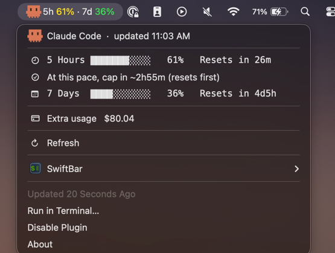

# Claude Code Usage for SwiftBar

This [SwiftBar](https://github.com/swiftbar/SwiftBar) plugin shows Claude Code's
rolling **5-hour** and **7-day** usage in the macOS menu bar. It uses the same data
as Claude Code's `/usage` command.



The crab reacts as either window approaches its limit. The 5-hour row estimates when
the current average pace will reach the limit.

## Security and data

The plugin reads Claude Code's OAuth access token from your macOS Keychain. It keeps
the token in memory and sends it only to `api.anthropic.com` over HTTPS. It doesn't
write the token to disk or refresh it.

The cache in `$TMPDIR` stores the last usage result and fetch time. It contains no
credentials.

The plugin uses only Node.js built-ins. It requires no API key or background service.

## Requirements

- macOS with [SwiftBar](https://github.com/swiftbar/SwiftBar)
- Node.js 18 or later on your `PATH`
- An active Claude Code login

## Install

1. Install SwiftBar:

   ```bash
   brew install --cask swiftbar
   ```

2. Open SwiftBar and select a plugin folder.

3. Clone this repository and run the installer:

   ```bash
   git clone https://github.com/agusalvarez6/claude-code-usage-swiftbar.git
   cd claude-code-usage-swiftbar
   ./install.sh
   ```

4. On the first run, click **Always Allow** when macOS asks to read the
   `Claude Code-credentials` Keychain item.

`install.sh` copies `cc-usage.2m.js` into SwiftBar's plugin folder and refreshes it.
Run it again after pulling updates. The installer preserves the configured refresh
interval.

To uninstall the plugin, delete the installed file:

```bash
rm "$(defaults read com.ambar.SwiftBar PluginDirectory)"/cc-usage.*m.js
```

## Behavior

- The menu bar shows usage in green below 50%, yellow from 50% through 89%, and red
  at 90% or higher.
- SwiftBar sends the 90% notification only when macOS grants permission in
  **System Settings > Notifications**.
- After a failed request, the plugin shows the most recent successful result. It
  marks that result as cached after 10 minutes.
- The filename controls the polling interval. Rename the installed file to
  `cc-usage.5m.js` or `cc-usage.10m.js` to poll less often. The installer preserves
  the renamed file.
- If SwiftBar reports "node not found," add the Node.js executable path to the
  launcher list on line 2 of `cc-usage.2m.js`.

## Limitations

- The plugin uses Claude Code's undocumented `/api/oauth/usage` endpoint. An endpoint
  change can break the plugin.
- If the token expires, open Claude Code to renew your login.

This project isn't affiliated with Anthropic or SwiftBar.

## License

MIT. See [LICENSE](LICENSE).
